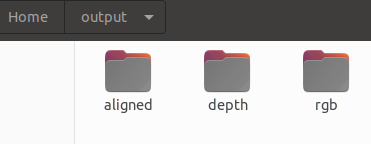
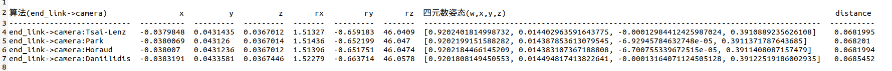

# Aruco-detection-and-tracking

## Launch文件运行

### jaka机械臂启动

```shell
cd ~/catkin_ws
source ./devel/setup.sh

roslaunch jaka_ros_driver start.launch  # 启动jaka的基本底层驱动，启动后需要等待几秒，等控制柜的灯为绿色
rosrun control_msgs jaka5_server        # 接收从moveit中发来的ros topic，并对指令进行处理
roslaunch jaka5_config demo.launch      # 启动moveit 同时打开rviz
```
### 二维码标定

```shell
roslaunch realsense2_camera rs_camera.launch     #启动realsense camera
roslaunch jaka_control calib.launch              #启动运动规划
roslaunch handeye-calib aruco_single.launch  #启动二维码位姿识别
roslaunch handeye-calib online_hand_on_eye_calib_auto.launch  #启动在线手眼标定
```
### Aruco码跟踪
```shell
roslaunch jaka_control aruco_maker_find.launch   #相机到达aruco码上方
```


## 说明
### 标定部分
```shell 
online_hand_on_eye_calib_auto.launch
```
在启动该文件之前，在Home/hanglok(linux用户名)下创建output文件夹，进入文件夹后创建以下文件夹：



这部分是为了减少online_hand_on_eye_calib_auto.py的运行报错，也可根据报错内容进行添加。

运行这个online_hand_on_eye_calib_auto.launch文件后，根据终端提示进行眼在手标定：
```shell
r 记录,c 计算,s  保存,q  退出:
```
在启动```shell roslaunch jaka_control calib.launch```后，当机械臂到达标定目标附近并暂停时，在终端键入：r。当机械臂移动到另一个位置并暂停后，继续键入r，直到机械臂停止标定视角改变（大概20次）。
完成相机对不同视角的aruco码的图片采集后，在终端键入c进行AX=XB不同算法的X求解等计算。
键入s保存计算结果，在output文件夹中会出现终端提示保存的文件名。



### Aruco码跟踪部分
```shell
roslaunch jaka_control aruco_maker_find.launch   #相机到达aruco码上方
```
需要在launch文件对应的arco_pos.py中修改眼在手标定结果：
```shell
  cam_pos =[-0.038007,   0.0431236,  0.0367012]
  cam_ori = [0.014383107367188808, -6.700755339672515e-05, 0.3911408087157479, 0.9202184466145209]#[0.01414568946395788, -0.00257750271097712, 0.39945193875924767, 0.9166413718411591] # xyzw
  H_h2c = None
```
注意cam_ori的顺序为xyzw，与标定结果文件中四元数结果的顺序略有不同，需要稍微修改一下。


